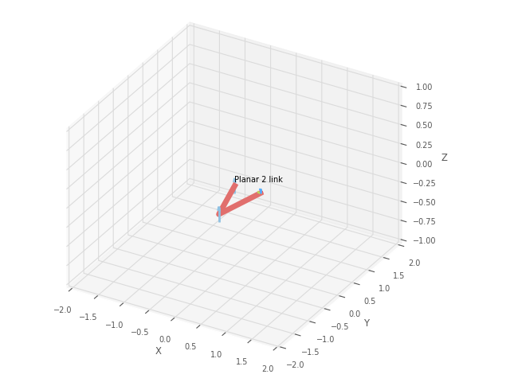

#  Optimal Control of 2 DOF Robot for ball catching sequence
Implemented an Optimal Control strategy on a 2 DOF robot to catch a moving ball and bringing it to rest

How to run the code:
The Optimal_control file contains all the functions and the main Optimal Control function that decides the end effector location.

The code uses the minimize function from the Scipy.optimize library to minimize the error in end effector and ball position. 

The following gif shows the movement of the robot in 3D environment to execute the catching sequence.

## *Best case scenario where the robot catches the moving ball*
The robot moves and starts at time t = 0 when the ball starts moving. The robot catches the ball at time t = 2 sec and stops the moving ball after catching.

The following gif shows the ball moving and the robot catching the ball at specified location and bringing it to rest after catching.

The robot parameters can be set according to ball speed such that the catching sequence is consistent with the moving ball.

